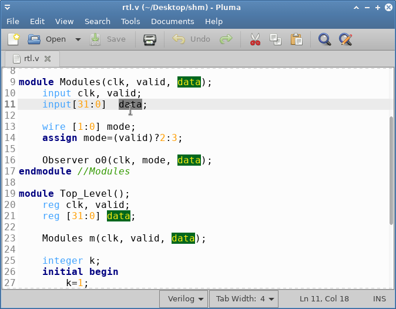

## Smart Highliting pluma plugin (updated - fork)

This is a new port of the [smart-highlighting-gedit](https://code.google.com/p/smart-highlighting-gedit/) Gedit plugin for Pluma.

This `Readme.md` file and the naming is based on an earlier port for Pluma: [smart-highlighting-pluma-plugin](https://github.com/maciejzgadzaj/smart-highlighting-pluma-plugin/).

This version was tested on Tue 29 Oct 2019 using the kernel Linux 5.1.18-300.fc30.x86_64 and Pluma version 1.22.2. 

## Features

* Highlight occurrences of current selected text
* Match occurrences using regular expression
* Highlighting colors and matching options are configurable
* Multi-language support

## Installation

* Extract files to directory `~/.local/share/gedit/plugins/`
* Run **pluma** text editor
* In pluma main menu go to: **Edit** -> **Preferences**
* In **Preferences** dialog go to **Plugins** tab
* Find **Smart Highlighting** in plugin list and check it

